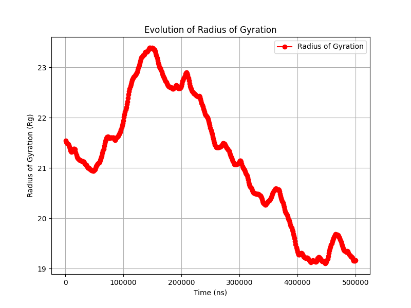

# **Coarse-Grained Polymer Simulation Using LAMMPS, Python, and OVITO**

This repository contains a coarse-grained polymer model created using **LAMMPS**, **Python**, and **OVITO**. The project simulates the behavior of a polymer chain in a solvated system and analyzes its structural and viscoelastic properties.

## **Workflow Overview**

1. **Generation of Polymer Chain**
   - Created a random polymer chain configuration using Python.

2. **Equilibration**
   - Performed energy minimization and equilibration using LAMMPS.

3. **Solvation**
   - Embedded the polymer chain in a cubic simulation box filled with solvent molecules.

4. **Analysis & Visualization**
   - **End-to-End Distance Distribution** – Measured the distance between polymer chain termini.
   - **Radius of Gyration** – Evaluated the compactness of the polymer.
   - **Stress Autocorrelation Function** – Analyzed internal stress fluctuations.
   - **Viscoelastic Properties** – Computed storage modulus (G') and loss modulus (G'') using Fourier transform methods.

## **Tools & Software Used**

- **LAMMPS** – Molecular dynamics simulation engine.
- **Python** – Data analysis and preprocessing.
- **OVITO** – Visualization and post-processing of trajectory files.
- **Matplotlib & NumPy** – Data visualization and numerical analysis.

## **How to Run the Simulation**

1. Clone the repository:

   ```sh
   git clone https://github.com/your-username/your-repo.git
   cd your-repo
   ```

2. Run Python and LAMMPS simulation:

   ```sh
   py generate.py
   lmp -in in.equilibrate.lammps
   lmp -in in.solvate.lammps
   lmp -in in.production.lammps
   ```

3. Analyze results using Python scripts:

   ```sh
   py analysis.py
   ```

4. Visualize trajectories in OVITO.

## **Results**

### **Radius of Gyration Evolution**



---
